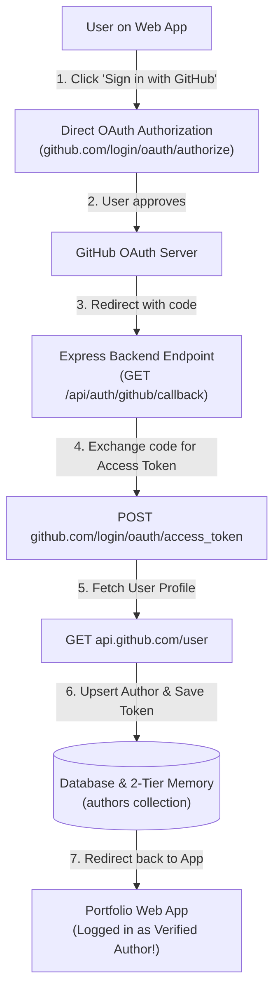

# Implementation Plan - Direct Native GitHub OAuth 2.0 (No Firebase Dependency)

Replace client-side Firebase Auth with **Direct Native GitHub OAuth 2.0**. Gives 100% control over the `redirect_uri`, removes all Firebase SDK setup errors, and works seamlessly with local and production server callback URLs.

---

## 1. Direct Native OAuth 2.0 Flow

* **Zero Firebase Auth Dependencies**: No `auth/api-key-not-valid`, `operation-not-allowed`, or Firebase domain restrictions.
* **Full Control of `redirect_uri`**: Set callback URL directly to `http://localhost:3000/api/auth/github/callback` (or production domain).
* **Direct Access Token Handling**: Server gets the GitHub Access Token directly and stores it in the user's `integrations` matrix for Layer 1 Data Providers (`GitHubAppProvider.ts`).

---

## Proposed Changes

### Backend & Direct OAuth Routes

#### [MODIFY] [server.ts](file:///Users/ssemenov/Documents/antigravity/portfolist.node.srv/server.ts)
- Add direct OAuth authorization and callback endpoints:
  - `GET /api/auth/github/login`: Redirects browser to `https://github.com/login/oauth/authorize?client_id=...&scope=read:user,repo`.
  - `GET /api/auth/github/callback`: Receives `code`, exchanges for `access_token`, fetches `api.github.com/user`, creates/upserts author, and redirects user back to `/?login=success&user=${username}`.

---

### Frontend UI Updates

#### [MODIFY] [src/services/authProviders.ts](file:///Users/ssemenov/Documents/antigravity/portfolist.node.srv/src/services/authProviders.ts)
- Update `loginWithOAuthProvider` to use direct native server redirect (`window.location.href = '/api/auth/github/login'`).

#### [MODIFY] [src/components/OAuthModal.tsx](file:///Users/ssemenov/Documents/antigravity/portfolist.node.srv/src/components/OAuthModal.tsx)
- Connect GitHub button directly to `/api/auth/github/login`.

---

## Verification Plan

### Automated Verification
1. **Direct OAuth Callback Endpoint**:
   - Access `GET /api/auth/github/login` -> Confirm redirect to GitHub authorization URL with proper `client_id` & `redirect_uri`.
2. **Type Check & Build**:
   - Run `npx tsc --noEmit` and `npm run build`.
