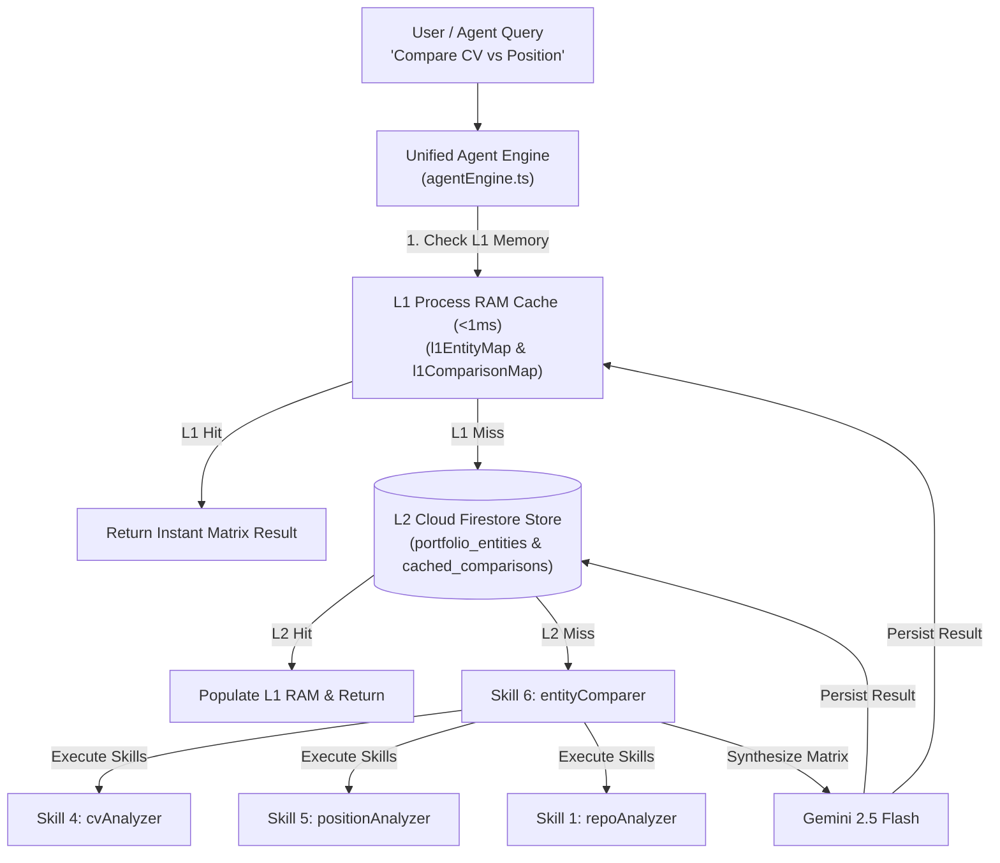

# Implementation Plan - Universal Entity Agent Skills & Multi-Entity Matrix Comparison

Expand the Candidate Agent into a **Universal Portfolio Entity System**, enabling the agent to analyze, classify, and compare **any portfolio entity** (**`repo`**, **`cv`**, **`position`**, **`research`**) against any other entity in terms of **skills** and **working conditions**.

---

## 1. Database & Agent Memory Structures (Cloud Firestore / MongoDB)

### A. DB Collections (`src/services/mongoFirestore.ts` & Firestore)

1. **`portfolio_entities` Collection**:
   Stores parsed metadata, extracted skills, and conditions for any portfolio item.
   ```typescript
   export interface PortfolioEntity {
     id: string; // e.g. "ent_cv_usr_alex_01" or "ent_repo_phgrey_grafin"
     authorId: string;
     authorUsername: string;
     entityType: 'repo' | 'cv' | 'position' | 'research';
     title: string;
     sourceUrl?: string;
     contentRaw: string; // Raw CV text, job description, or repo summary
     extractedSkills: {
       primaryLanguages: string[];
       frameworksAndTools: string[];
       domainExpertise: string[];
       softSkills: string[];
     };
     conditions?: {
       experienceLevel?: string; // e.g. "Senior", "Lead", "Architect"
       workMode?: 'remote' | 'hybrid' | 'onsite';
       location?: string;
       keyRequirements?: string[];
     };
     updatedAt: string;
   }
   ```

2. **`cached_comparisons` Collection**:
   Caches cross-entity skill & condition comparison matrices across server restarts.
   ```typescript
   export interface CachedEntityComparison {
     id: string; // Deterministic key: "cmp_<entityA_id>__vs__<entityB_id>"
     entityAId: string;
     entityBId: string;
     matchScore: number; // 0 to 100
     skillOverlap: string[];
     skillGaps: string[];
     conditionMatches: string[];
     conditionMismatches: string[];
     detailedRationale: string;
     cachedAt: string;
   }
   ```

### B. 2-Tier Memory Caching Architecture



---

## 2. New & Expanded Agent Skills

We expand the Agent Skills Engine with 3 new specialized skills:

| Skill | Module | Purpose |
| :--- | :--- | :--- |
| **Skill 1 (Existing)** | `repoAnalyzer.ts` | Inspects GitHub repositories for production readiness, stars, CI/CD, and languages. |
| **Skill 2 (Existing)** | `authorProfiler.ts` | Aggregates repository profiles into developer archetype & overall strengths/weaknesses. |
| **Skill 3 (Existing)** | `positionMatcher.ts` | Matches candidate repos against position requirements. |
| **[NEW] Skill 4** | `cvAnalyzer.ts` | Parses CV / Resume documents, extracting work history, key skills, domain expertise, and developer preferences/conditions. |
| **[NEW] Skill 5** | `positionAnalyzer.ts` | Parses Position Description documents (raw text or web URLs), extracting required skills, nice-to-haves, role level, and position conditions. |
| **[NEW] Skill 6** | `entityComparer.ts` | Universal matrix comparison skill that compares **ANY Entity A** (`cv`, `repo`, `author`) against **ANY Entity B** (`position`, `cv`, `repo`), producing skill overlaps, missing gaps, condition compatibility, and fit score (0-100). |

---

## Proposed Changes

### Data Models & Database Services

#### [MODIFY] [src/types.ts](file:///Users/ssemenov/Documents/antigravity/portfolist.node.srv/src/types.ts)
- Add `PortfolioEntity` and `CachedEntityComparison` interfaces.

#### [NEW] [src/services/entityMemory.ts](file:///Users/ssemenov/Documents/antigravity/portfolist.node.srv/src/services/entityMemory.ts)
- Manage L1 RAM and L2 Firestore caching for entities and cross-entity comparisons.
- `savePortfolioEntity(...)`, `getPortfolioEntity(...)`, `getCachedComparison(...)`, `saveCachedComparison(...)`.

---

### New Skill Modules

#### [NEW] [agent/skills/cvAnalyzer.ts](file:///Users/ssemenov/Documents/antigravity/portfolist.node.srv/agent/skills/cvAnalyzer.ts)
- Skill to parse CV documents and extract structured skills & candidate conditions.

#### [NEW] [agent/skills/positionAnalyzer.ts](file:///Users/ssemenov/Documents/antigravity/portfolist.node.srv/agent/skills/positionAnalyzer.ts)
- Skill to parse Position description text or web page URLs and extract structured position requirements & conditions.

#### [NEW] [agent/skills/entityComparer.ts](file:///Users/ssemenov/Documents/antigravity/portfolist.node.srv/agent/skills/entityComparer.ts)
- Universal cross-entity comparison matrix logic. Evaluates skills overlap and condition alignment between any two portfolio entities.

---

### Agent Dialogue & UI Integration

#### [MODIFY] [src/services/agentEngine.ts](file:///Users/ssemenov/Documents/antigravity/portfolist.node.srv/src/services/agentEngine.ts)
- Enhance intent routing to support universal cross-entity comparison queries:
  - *"Compare CV [id] against Position [id/link]"*
  - *"Compare repo [phgrey/grafin] against Position [link]"*
  - *"Evaluate candidate conditions against position conditions"*

#### [MODIFY] [src/components/AgentChatDrawer.tsx](file:///Users/ssemenov/Documents/antigravity/portfolist.node.srv/src/components/AgentChatDrawer.tsx)
- Add quick action pills for CV vs Position comparison and entity skill matrix analysis.

---

## Verification Plan

### Automated & Integration Verification
1. **Entity Parsing Test**:
   - Parse sample CV text -> Verify extracted skills & experience conditions.
   - Parse position link -> Verify extracted required skills & job conditions.
2. **Universal Cross-Entity Matrix Test**:
   - Compare CV vs Position Document -> Verify fit score, skill overlap, gaps, and condition matching.
   - Compare Repo vs Position Document -> Verify technical readiness vs role requirements.
   - 2nd comparison run -> Verify instant **<1ms** L1 RAM cache hit!
