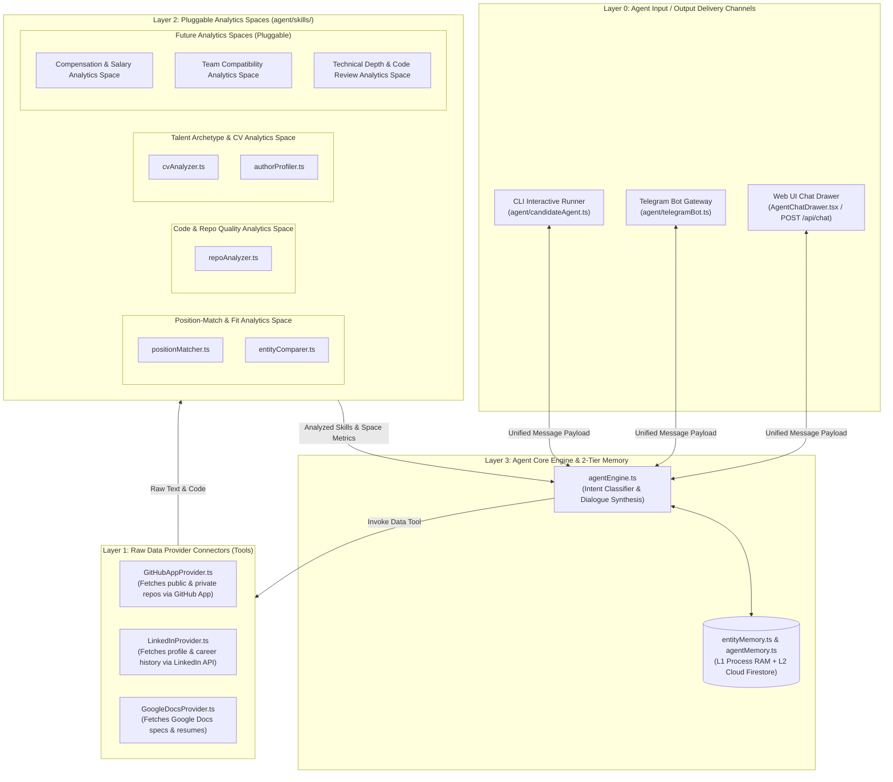

# Implementation Plan - 4-Layer System Architecture with Pluggable Analytics Spaces

Structure the codebase into a clean, decoupled **4-Layer Architecture**, with Layer 2 explicitly designed as **Pluggable Analytics Spaces**:

---

## 1. System Architecture Diagram

---

## Proposed Changes

### Layer 1: Data Provider Connectors (`src/services/providers/`)

#### [NEW] [src/services/providers/BaseProvider.ts](file:///Users/ssemenov/Documents/antigravity/portfolist.node.srv/src/services/providers/BaseProvider.ts)
- Abstract interface `IDataProvider`:
  - `providerId: PlatformType`
  - `fetchRawUserData(username: string): Promise<RawUserData>`
  - `fetchRawRepositoryData(repoName: string): Promise<RawRepoData>`

#### [NEW] [src/services/providers/GitHubAppProvider.ts](file:///Users/ssemenov/Documents/antigravity/portfolist.node.srv/src/services/providers/GitHubAppProvider.ts)
- Implementation fetching raw repo code and metadata via GitHub App credentials.

#### [NEW] [src/services/providers/LinkedInProvider.ts](file:///Users/ssemenov/Documents/antigravity/portfolist.node.srv/src/services/providers/LinkedInProvider.ts)
- Pluggable provider fetching raw LinkedIn profile, work experience, and recommendations.

---

## Verification Plan

### Automated Verification
1. **Provider Abstraction Check**:
   - Verify `GitHubAppProvider` and `LinkedInProvider` implement `IDataProvider`.
2. **Channel & Space Routing Check**:
   - Verify Web UI and Telegram Bot route through `agentEngine.ts` to Layer 2 Analytics Spaces.
3. **Type Check & Build**:
   - Run `npx tsc --noEmit` and `npm run build`.
