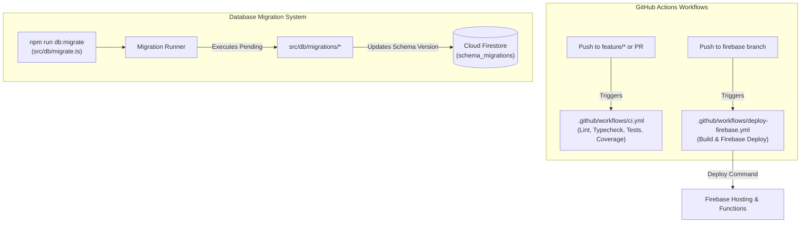

# Implementation Plan - GitHub Actions CI/CD Pipelines & Database Migration System

Build two production-grade **GitHub Actions Workflows** and a **Database Migration Engine** for Cloud Firestore / MongoDB schema management:

1. **Firebase Deployment Pipeline (`.github/workflows/deploy-firebase.yml`)**: Triggered on push to `firebase` branch. Deploys web hosting and functions.
2. **CI/CD Quality Pipeline (`.github/workflows/ci.yml`)**: Triggered on push to `feature/*` branches and Pull Requests. Executes linting, type checking, unit tests, code coverage, and static analysis.
3. **Database Migration Engine (`src/db/migrate.ts`)**: Version-controlled migration system tracking schema migrations (`001_initial_collections.ts`, `002_author_integrations_indexes.ts`) with `npm run db:migrate`.

---

## 1. Pipeline & Migration Architecture

---

## Proposed Changes

### Database Migration System

#### [NEW] [src/db/migrate.ts](file:///Users/ssemenov/Documents/antigravity/portfolist.node.srv/src/db/migrate.ts)
- Migration Runner CLI script:
  - Tracks executed migrations in `schema_migrations` collection in Firestore.
  - Sequentially applies pending migration files (`001_...`, `002_...`).
  - Supports `--rollback` and `--status`.

#### [NEW] [src/db/migrations/001_initial_schema.ts](file:///Users/ssemenov/Documents/antigravity/portfolist.node.srv/src/db/migrations/001_initial_schema.ts)
- Initial migration establishing core collections (`authors`, `portfolio_entities`, `cached_analyses`, `cached_comparisons`, `author_project_sets`).

#### [NEW] [src/db/migrations/002_add_integrations_indexes.ts](file:///Users/ssemenov/Documents/antigravity/portfolist.node.srv/src/db/migrations/002_add_integrations_indexes.ts)
- Indexing & schema migration adding multi-provider integration metadata structure to author documents.

---

### Tests & Quality Assurance Setup

#### [NEW] [src/tests/agentEngine.test.ts](file:///Users/ssemenov/Documents/antigravity/portfolist.node.srv/src/tests/agentEngine.test.ts)
- Test suite verifying intent classification (`describe_me`, `describe_repo`, `match_position`, `compare_entities`) and dialogue responses.

#### [NEW] [src/tests/entityMemory.test.ts](file:///Users/ssemenov/Documents/antigravity/portfolist.node.srv/src/tests/entityMemory.test.ts)
- Test suite verifying 2-tier memory L1 process cache hits (`<1ms`) and L2 Firestore persistence.

#### [MODIFY] [package.json](file:///Users/ssemenov/Documents/antigravity/portfolist.node.srv/package.json)
- Add scripts: `test`, `test:coverage`, `lint`, `db:migrate`, `db:migrate:status`.
- Add `vitest` / `@vitest/coverage-v8` or test runner dependencies.

---

### GitHub Actions Workflows & Firebase Config

#### [NEW] [.github/workflows/ci.yml](file:///Users/ssemenov/Documents/antigravity/portfolist.node.srv/.github/workflows/ci.yml)
- GitHub Actions CI workflow triggered on `push` to `feature/*` and `pull_request` to `main`/`firebase`:
  1. Setup Node.js 20 & cache npm packages.
  2. Run `npm run lint` (Static code analysis).
  3. Run `npx tsc --noEmit` (TypeScript type check).
  4. Run `npm run build` (Vite & server build validation).
  5. Run `npm run test:coverage` (Unit tests & coverage report).
  6. Run `npm run db:migrate:status` (Dry-run migration validation).

#### [NEW] [.github/workflows/deploy-firebase.yml](file:///Users/ssemenov/Documents/antigravity/portfolist.node.srv/.github/workflows/deploy-firebase.yml)
- GitHub Actions CD workflow triggered on `push` to `firebase` branch:
  1. Build frontend & backend artifacts (`npm run build`).
  2. Run database migrations (`npm run db:migrate`).
  3. Deploy to Firebase Hosting & Functions (`FirebaseExtended/action-hosting-deploy` or `w9jds/firebase-action`).

#### [NEW] [firebase.json](file:///Users/ssemenov/Documents/antigravity/portfolist.node.srv/firebase.json) & [.firebaserc](file:///Users/ssemenov/Documents/antigravity/portfolist.node.srv/.firebaserc)
- Configures Firebase Hosting target serving `dist/` and rewrites to Cloud Functions / Express backend.

---

## Verification Plan

### Automated Verification
1. **CI Pipeline Validation**:
   - Run `npm run lint` -> Confirm 0 lint errors.
   - Run `npm run test:coverage` -> Confirm unit tests pass with coverage report.
   - Run `npm run db:migrate` -> Confirm database migrations execute cleanly.
2. **GitHub Actions Syntax Validation**:
   - Validate `.github/workflows/ci.yml` and `.github/workflows/deploy-firebase.yml` YAML syntax.
