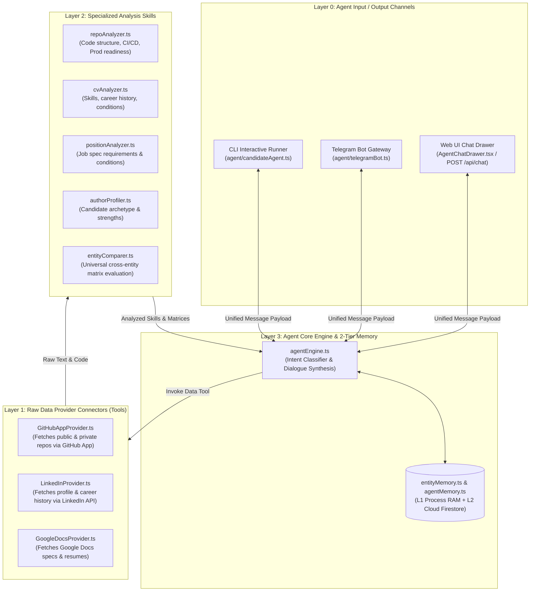

# Implementation Plan - Complete 4-Layer System Architecture (Channels, Providers, Skills, Engine)

Refactor and structure the codebase into a clean **4-Layer Architecture**:
1. **Layer 0: Communication Delivery Channels (`agent/channels/`)** — Telegram Bot, Web UI Chat Drawer (`AgentChatDrawer.tsx`), and CLI Runner.
2. **Layer 1: Raw Data Provider Connectors (`src/services/providers/`)** — GitHub App (Public/Private repos), LinkedIn, Google Docs.
3. **Layer 2: Specialized Analysis Skills (`agent/skills/`)** — Repositories, CVs, Position Specs, Candidate Profiler, Matrix Comparer.
4. **Layer 3: Agent Core & 2-Tier Memory (`src/services/`)** — Orchestration engine & L1 RAM + L2 Firestore caching.

---

## 1. System Architecture Diagram

---

## Proposed Changes

### Layer 1: Data Provider Connectors (`src/services/providers/`)

#### [NEW] [src/services/providers/BaseProvider.ts](file:///Users/ssemenov/Documents/antigravity/portfolist.node.srv/src/services/providers/BaseProvider.ts)
- Interface `IDataProvider`:
  - `providerId: PlatformType`
  - `fetchRawUserData(username: string): Promise<RawUserData>`
  - `fetchRawRepositoryData(repoName: string): Promise<RawRepoData>`

#### [NEW] [src/services/providers/GitHubAppProvider.ts](file:///Users/ssemenov/Documents/antigravity/portfolist.node.srv/src/services/providers/GitHubAppProvider.ts)
- Concrete provider fetching raw public & private repo code and metadata via GitHub App credentials.

#### [NEW] [src/services/providers/LinkedInProvider.ts](file:///Users/ssemenov/Documents/antigravity/portfolist.node.srv/src/services/providers/LinkedInProvider.ts)
- Pluggable provider fetching raw LinkedIn profile, work experience, and recommendations.

---

### Layer 0, 2 & 3 Integration

#### [MODIFY] [src/services/agentEngine.ts](file:///Users/ssemenov/Documents/antigravity/portfolist.node.srv/src/services/agentEngine.ts)
- Receives messages from **Telegram (`telegramBot.ts`)** and **Web UI (`AgentChatDrawer.tsx`)**, routes intent, delegates to Layer 1 Data Providers & Layer 2 Analysis Skills, and caches in Layer 3 2-Tier Memory.

---

## Verification Plan

### Automated Verification
1. **Provider Abstraction Check**:
   - Verify `GitHubAppProvider` and `LinkedInProvider` implement `IDataProvider`.
2. **Channel Routing Check**:
   - Verify Web UI and Telegram Bot pass payloads to `agentEngine.ts` and receive clean responses.
3. **Type Check & Build**:
   - Run `npx tsc --noEmit` and `npm run build`.
